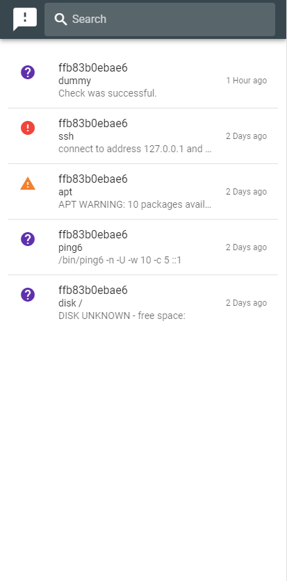

# README

This project is a simple Frontend app to use with icinga2_api_request backend (https://github.com/jtejedera/icinga2_api_request)

It's built with Vue.js, Vuetify and Socket.io.



## Project configuration

* Change Node.js Backend API server address and Socket.io namespace address:
```
Node.js Backend API server                      -   Line 12 main.js (http://<backend_api>:8000/api)
Node.js Backend API socker.io namespace         -   Line 23 main.js (http://<backend_api>:8000)
```

## Project setup
```
npm install
```

### Compiles and hot-reloads for development
```
npm run serve
```

### Compiles and minifies for production
```
npm run build
```

### Customize configuration
See [Configuration Reference](https://cli.vuejs.org/config/).
